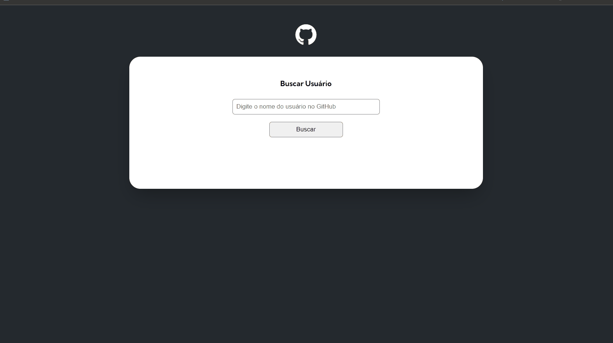

# Curso DevQuest | Projeto Inicial Fetch Github Api

## Tabela do Conteudo

<ul>
<li><a href="#sobre">Sobre</a></li>
<li><a href="#desafio">Desafio</a></li>
<li><a href="#status">Status</a></li>
<li><a href="#curiosidade">Curiosidade</a></li>
<li><a href="#tecnologias">Tecnologias</a></li>
</ul>

## Sobre

### Esse projeto foi bifurcado do "Projeto Inicial Fetch GitHub API" do curso DevQuest - Dev em Dobro.

#### 1º - Commit está associado a resolução deste projeto acompanhando as aulas do curso com o intuito de nos apresentarmos como funciona a API do GitHub, exibindo apenas imagem, nome completo, login e a bio do usuário. 

#### 2º - Commit é a minha resolução do desafio do curso dando continuidade no projeto, e tentando realizar as três missões solicitadas. 

#### 3º - Commit é a refatoração após ser conferido e analisado pela monitoria do curso.

## Desafio

<li>Solicitação 1: O seu gerente de projetos veio com uma nova solicitação para ser acrescentada no projeto que busca as informações do usuário do GitHub. Agora além de trazer imagem, nome completo, login e a bio do usuário, você precisa mostrar também:

    Número de seguidores do usuário;✅

    Número de pessoas que o usuário está seguindo.✅

<li>Solicitação 2: O seu gerente de projetos veio com uma nova solicitação para ser acrescentada no projeto. Agora ele quer apresentar as informações dos últimos eventos do usuário no GitHub. A solicitação é a seguinte:

    Você deve apresentar na tela uma lista com até 10 últimos eventos do usuário no GitHub. Os eventos que serão apresentados são de dois tipos: CreateEvent e PushEvent apenas;✅

    Para cada atividade você deve mostrar o nome do repositório e a mensagem do evento.✅

<li>Solicitação 3: O seu gerente de projetos veio com com uma nova solicitação para ser acrescentada no projeto que busca as informações dos repositórios do usuário do GitHub. Agora além de trazer o nome do repositório e link do repositório, você precisa mostrar também:

    Quantidade de forks do repositório;✅

    Quantidade de estrelas do repositório;✅
    
    Quantidade de watchers do repositório;✅

    Mostrar a linguagem de programação do repositório.✅

## Status

Desafio finalizado. 🥰

### Layout Desktop / Mobile

## Curiosidade

Este desafio me proporcionou muita satisfação ao concluí-lo. Além disso, pude observar a qualidade da estrutura e organização do código, que são ensinadas pelos professores do curso DevQuest no módulo de JavaScript. Consegui compreender todas as explicações sobre a construção do código e pude concluir as 3 solicitações, mantendo a estrutura original do código.

## Tecnologias

<ul>
<li>HTML</li>
<li>CSS</li>
<li>JavaScript</li>
<li>GIT</li>
</ul>